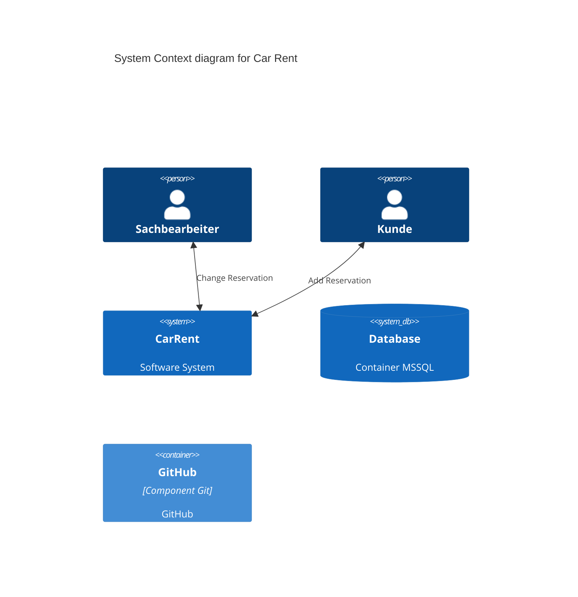

# CarRent

## 1. C4 Model

### 1.1. - Context


### Test

```mermaid
C4Context
    title Container diagram for Internet Banking System

    Person(customer, Customer, "A customer of the bank, with personal bank accounts")

    System_Boundary(c1, "Internet Banking") {
        Container(web_app, "Web Application", "Java, Spring MVC", "Delivers the static content and the Internet banking SPA")
        Container(spa, "Single-Page App", "JavaScript, Angular", "Provides all the Internet banking functionality to customers via their web browser")
        Container(mobile_app, "Mobile App", "C#, Xamarin", "Provides a limited subset of the Internet banking functionality to customers via their mobile device")
        ContainerDb(database, "Database", "SQL Database", "Stores user registration information, hashed auth credentials, access logs, etc ")
        Container(backend_api, "API Application", "Java, Docker Container", "Provides Internet banking functionality via API")
    }

    System_Ext(email_system, "E-Mail System", "The internal Microsoft Exchange system")
    System_Ext(banking_system, "Mainframe Banking System", "Stores all of the core banking information about customers, accounts transactions, etc.")

    Rel(customer, web_app, "Uses", "HTTPS")
    Rel(customer, spa, "Uses", "HTTPS")
    Rel(customer, mobile_app, "Uses")

    Rel_Neighbor(web_app, spa, "Delivers")
    Rel(spa, backend_api, "Uses", "async, JSON/HTTPS")
    Rel(mobile_app, backend_api, "Uses", "async, JSON/HTTPS")

    Rel_Back(customer, email_system, "Sends e-mails to")
    Rel_Back(email_system, backend_api, "Sends e-mails using", "sync, SMTP")
```

### 1.2. - Containers

### 1.3. - Compontents

### 1.4. - Classes

## 2. Use Cases

## 3. Domain Model

## 4. Deployment View

## 5. Logical View

## 6. Implementation 

## 6.1. - Continuous Integration 

## 6.2. - Metriken

## 6.3. - Dokumentation arc42