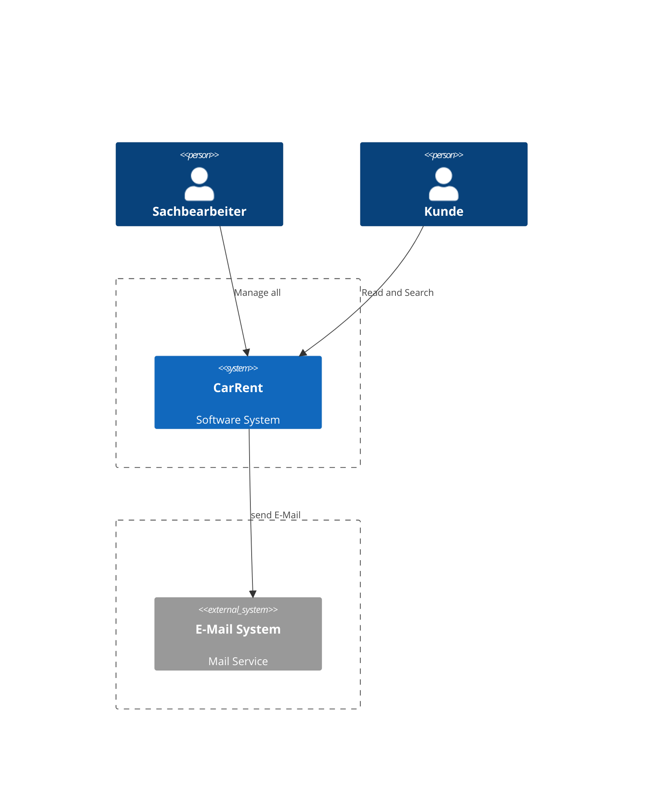
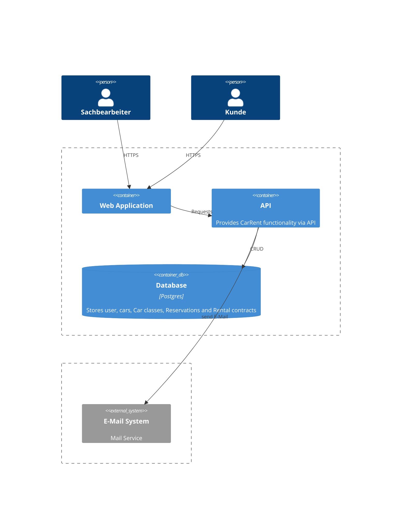
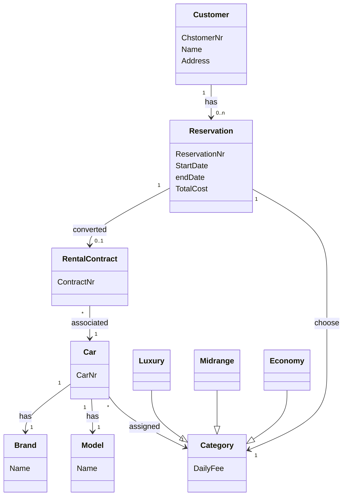

# CarRent

## 1.  Arbeitspaket 1 - C4 Model

### 1.1. - Context

### 1.2. - Containers

### 1.3. - Compontents

## 2.  Arbeitspaket 2 – Domain Model und Use Cases

### 2.1 Domain Model / Klassen Diagramm

### 2.2 Use Cases
| Nr     | User           | Ziel                                                                                                        |
| ------ | -------------- | ----------------------------------------------------------------------------------------------------------- |
| UC-001 | Sachbearbeiter | Nach Kunden mit Namen und Adresse und Kundennummer im System verwalten (erfassen, bearbeiten, löschen).     |
| UC-002 | Sachbearbeiter | Nach Kunden mit dessen Namen oder Kundennummer suchen.                                                      |
| UC-003 | Sachbearbeiter | Kann Autos verwalten und suchen.                                                                            |
| UC-004 | Sachbearbeiter | Auto einer bestimmten Klasse zuordnen.                                                                      |
| UC-005 | Sachbearbeiter | Pro Klasse kann eine Tagesgebür gesetzt werden.                                                             |
| UC-006 | Kunde          | Kunde kann eine Reservation tätigen mit einem Auto aus einer bestimmten Klasse und die Anzahl Tage angeben. |
| UC-007 | Kunde          | Kunde holt sein reserviertes Auto ab. Die Reservation wird zu einen Mietvertrag umgewandelt.                |

## 3.Arbeitspaket 3 – 4+1 Views

### 3.1 Deployment View

### 3.2 Logical View

## 4. Arbeitspaket 4 – Implementierung

## 5. Arbeitspaket 5 – Continuous Integration und Metriken

### 5.1 Continuous Integration

### 5.2. Metriken

## 6. Arbeitspaket 6 – Dokumentation (nach arc42)