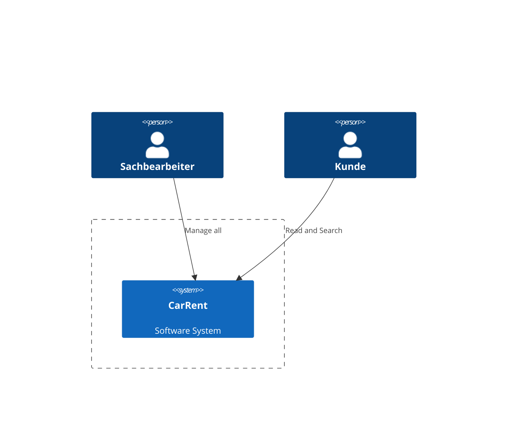
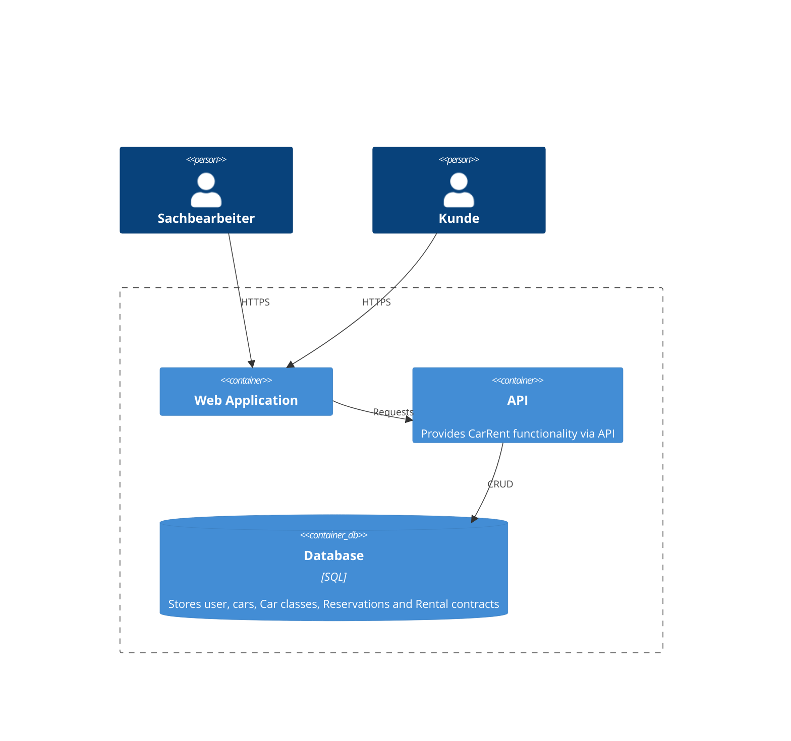
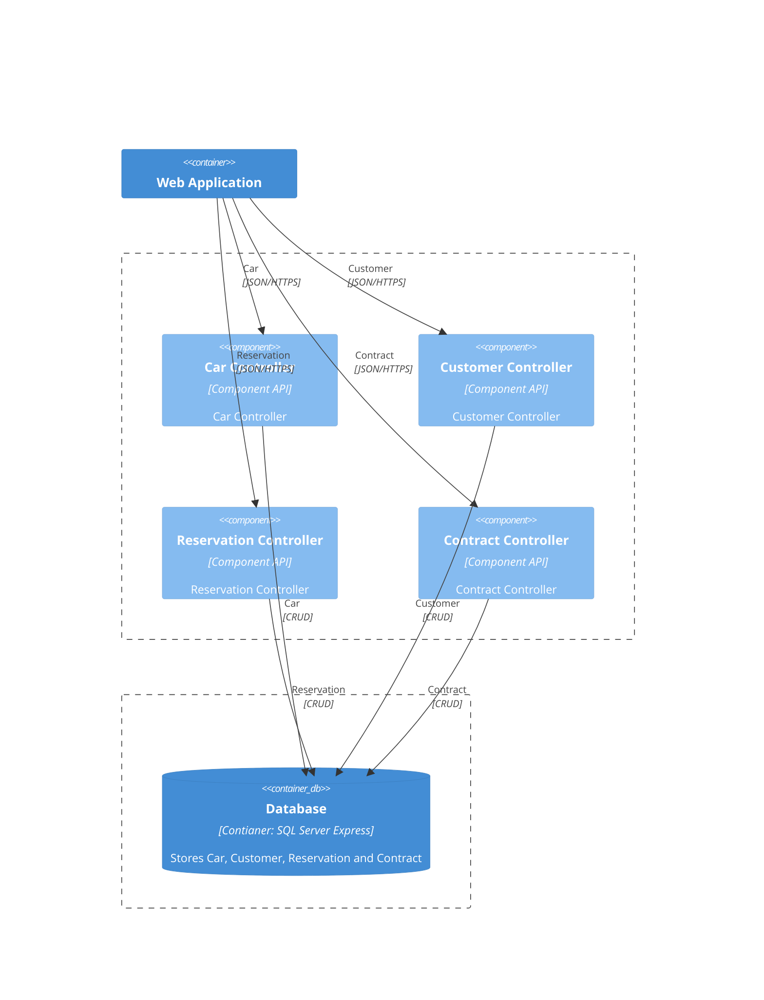
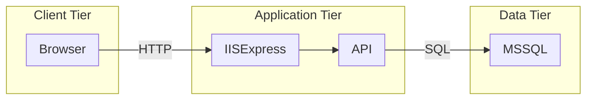

# CarRent

Mini-Projekt SAD

## 1.  Arbeitspaket - C4 Model

### 1.1. - Context

### 1.2. - Containers

### 1.3. - Compontents

## 2.  Arbeitspaket – Domain Model und Use Cases

### 2.1 Domain Model

### 2.2 Use Cases
| Nr     | Case                 | Actor          | Beschreibung                                                                                               |
| ------ | ----------------     | -------------- | ----------------------------------------------------------------------------------------------------------- |
| UC1 | Kunden verwalten     | Sachbearbeiter | Nach Kunden mit Namen und Adresse und Kundennummer im System verwalten (erfassen, bearbeiten, löschen).     |
| UC2 | Kunden suchen        | Sachbearbeiter | Nach Kunden mit dessen Namen oder Kundennummer suchen.                                                      |
| UC3 | Autos verwalten      | Sachbearbeiter | Kann Autos verwalten und suchen.                                                                            |
| UC4 | Autoklasse verwalten | Sachbearbeiter | Ein Auto einer bestimmten Klasse zuordnen und die Tagesgebür pro Klasse setzen.                          |
| UC5 | Reservation tätigen  | Kunde          | Der Kunde kann eine Reservation tätigen mit einem Auto aus einer bestimmten Klasse und die Anzahl Tage angeben. |
| UC6 | Reservation zu Mietvertrag umwandeln | Kunde    | Kunde holt sein reserviertes Auto ab. Die Reservation wird zu einen Mietvertrag umgewandelt.          |

## 3.Arbeitspaket – 4+1 Views

### 3.1 Deployment View

### 3.2 Logical View

## 4. Arbeitspaket – Implementierung

## 5. Arbeitspaket – Continuous Integration und Metriken

### 5.1 Continuous Integration

CI/CD - [GitHub Action](https://github.com/tsolenthaler/zbw-sad-carrent2124/actions)

### 5.2. Metriken

Metriken - 

## 6. Arbeitspaket – Dokumentation (nach arc42)