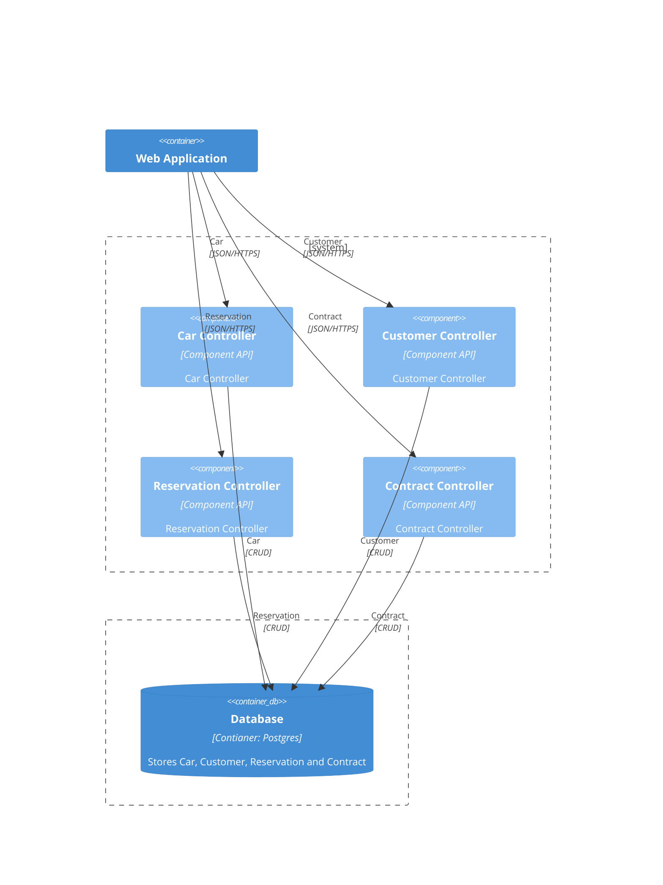

# CarRent

## 1. C4 Model

### 1.1. - Context

### 1.2. - Containers

### 1.3. - Compontents

### 1.4. - Classes

## 2. Use Cases

## 3. Domain Model

## 4. Deployment View

## 5. Logical View

## 6. Implementation 

## 6.1. - Continuous Integration 

## 6.2. - Metriken

## 6.3. - Dokumentation arc42